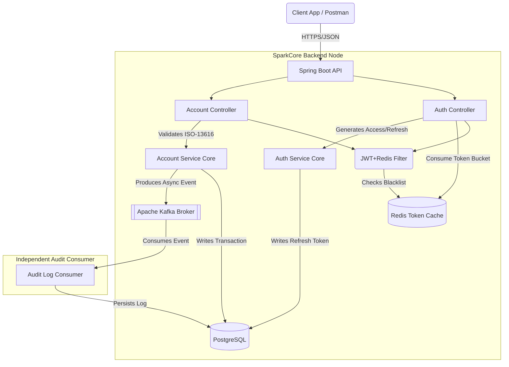

# 🏛️ SparkCore Banking Architecture


SparkCore is a high-performance, resilient, and secure financial backend API. This project demonstrates enterprise-grade architectural patterns, strict security mechanisms, and decoupled microservice communication standards heavily used in the banking sector.

## 🎯 Why I Built This

I built SparkCore to prove that I don't just know how to write code, but how to design robust distributed systems. Banking applications face unique challenges: strict auditing requirements, high-frequency brute-force attacks, and absolute atomicity in transactions.

This project addresses those challenges by implementing:
*   **Dual-Token Security Architectures** with instant revocation.
*   **Distributed Rate Limiting** to thwart credential stuffing across clusters.
*   **Event-Driven Asynchronous Auditing** to ensure core transactions never block.
*   **Mathematical Domain Logic** (ISO 13616 German IBAN Modulo-97 validation).

---

## 🏗️ Architecture Diagram

SparkCore leverages an Event-Driven Architecture (EDA) to decouple the core transactional `AccountService` from the slower, strictly-required `AuditLogService`.



---

## 🔐 Key Architectural Decisions (ADRs)

I believe senior engineers must document their trade-offs. You can find detailed Markdown Architecture Decision Records in the [`/docs/adr/`](/docs/adr/) folder.

1.  **[ADR-0001: Statutory JWT Authentication]** - Why stateless validation scales infinitely better than server-side session stores.
2.  **[ADR-0002: Redis Distributed Rate Limiting]** - Why `ConcurrentHashMap` fails in load-balanced environments and why Lettuce+Bucket4j is superior.
3.  **[ADR-0003: Kafka Asynchronous Auditing]** - Why tight coupling transactions to audit logs destroys latency and how Event Streaming fixes it.
4.  **[ADR-0004: Dual Token Architecture]** - How issuing 7-day Refresh Tokens and 15-minute Access Tokens with a Redis Blacklist solves the JWT revocation flaw.

---

## 🚀 Features

### Security & Authentication
- **Dual-Token Flow (Access + Refresh):** Minimized attack windows. Refresh tokens are stored safely, while rotated access tokens are verified statelessly.
- **Stateful Logout (Redis):** Tokens are placed on a high-speed Redis Blacklist upon logout, rendering intercepted tokens useless instantly.
- **Global Rate Limiting:** Bucket4j intercepts malicious API spammers globally via Redis, saving database cycles.

### Core Banking Logic
- **ISO-13616 IBAN Generation:** Accounts are automatically assigned mathematically valid German IBANs utilizing Modulo-97 calculations (ISO 7064).
- **Custom Bean Validation (`@ValidIban`):** Automatically rejects transfers to fake/structurally-invalid IBANs on the HTTP layer.
- **ACID Transactions:** Full Rollback capabilities on failed transfers via Spring's declarative `@Transactional`.

### Observability & Quality
- **100% Passing Integration Tests:** `Testcontainers` spins up real ephemeral instances of PostgreSQL, Redis, and Kafka for true integration coverage.
- **Flyway Migrations:** Bulletproof, version-controlled database schemas.

---

## 🛠️ Getting Started

### Prerequisites
- Docker Desktop
- Java 21+

### 1. Boot Infrastructure (Database, Cache, Broker)
```bash
docker-compose up -d
```
*(Starts Postgres 15, Redis 7, and Kafka 3.8 in KRaft mode)*

### 2. Configure Local Secrets
Create a `src/main/resources/application-local.yaml` (gitignored) to store your passwords safely:
```yaml
spring:
  datasource:
    url: jdbc:postgresql://localhost:5432/sparkcore_db
    username: sparkcore_user
    password: my_secret_db_password
application:
  security:
    jwt:
      secret-key: [Your_Base64_256Bit_Secret]
```

### 3. Run the Backend
```bash
./mvnw spring-boot:run
```

---

## 📚 API interactive Documentation

Once running, explore the fully documented OpenAPI standard UI:
👉 **[http://localhost:8080/swagger-ui.html](http://localhost:8080/swagger-ui.html)**

### Core Endpoints

| Method | Endpoint | Description | Auth Required |
|---|---|---|---|
| `POST` | `/api/v1/auth/login` | Returns Access (15m) & Refresh (7d) Token | None |
| `POST` | `/api/v1/auth/refresh` | Rotates the Access & Refresh Tokens | Token |
| `POST` | `/api/v1/auth/logout` | Revokes the Refresh Token & Blacklists JWT | Token |
| `POST` | `/api/v1/accounts/transfer` | Validates IBANs and transfers money safely | Token |
| `GET` | `/api/v1/audit-logs` | Reads asynchronously processed Kafka logs | ADMIN |
